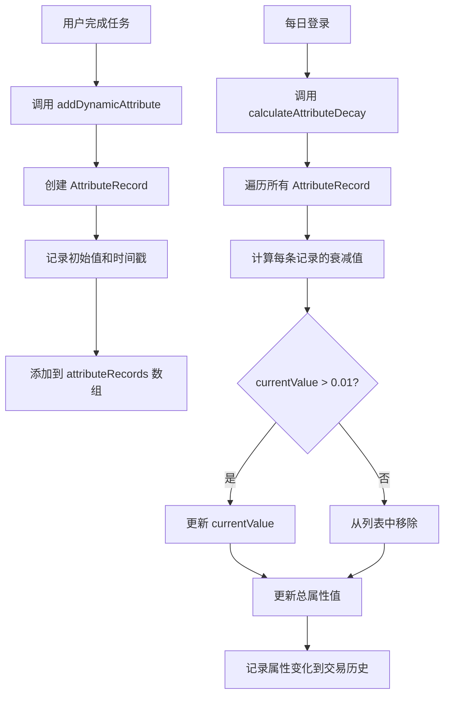

# 属性平衡系统设计文档

## 📋 目录

- [1. 系统概述](#1-系统概述)
- [2. 设计理念](#2-设计理念)
- [3. 核心机制](#3-核心机制)
- [4. 属性配置](#4-属性配置)
- [5. 使用指南](#5-使用指南)
- [6. 技术实现](#6-技术实现)
- [7. 数据结构](#7-数据结构)
- [8. API 接口](#8-api-接口)

---

## 1. 系统概述

### 1.1 什么是属性平衡系统？

属性平衡系统是 LifeRPG 中的一个动态属性管理机制，旨在模拟现实生活中技能和能力的**自然衰减现象**。

与传统静态属性系统不同，本系统中的每个属性值都会随着时间自然衰减，激励用户通过持续完成任务来维持属性平衡。

### 1.2 核心特点

- ✅ **动态衰减**：属性会随时间指数衰减，而非永久保持
- ✅ **独立追踪**：每次属性获取都有独立的衰减时间线
- ✅ **差异化设计**：不同属性有不同的半衰期和衰减速率
- ✅ **健康度评分**：基于近期活动计算属性健康状况
- ✅ **完整记录**：所有变化都记录在交易历史中

---

## 2. 设计理念

### 2.1 为什么需要属性衰减？

#### 现实映射
在现实生活中：
- 今天运动锻炼，体能提升，但如果长期不运动，体能会下降
- 学习一门技能后，如果不持续练习，会逐渐生疏
- 创意灵感需要持续培养，长期不创作会变得迟钝

#### 游戏化目标
- **防止躺平**：避免用户完成一批任务后长期不活跃
- **持续激励**：鼓励用户建立长期习惯，而非短期冲刺
- **平衡引导**：通过健康度提醒，引导用户关注薄弱属性

### 2.2 设计原则

1. **真实感**：衰减速率符合现实规律（如运动效果衰减快，知识保留时间长）
2. **可见性**：用户可以清晰看到属性衰减状态和健康度
3. **可控性**：用户可以通过完成任务来维持属性
4. **渐进性**：衰减是渐进的，不会突然归零

---

## 3. 核心机制

### 3.1 衰减模型

#### 指数衰减公式

```javascript
currentValue = initialAmount × (1 - decayRate)^daysPassed
```

**参数说明：**
- `currentValue`：当前剩余值
- `initialAmount`：初始获得的属性值
- `decayRate`：每日衰减率（百分比）
- `daysPassed`：经过的天数

#### 半衰期

半衰期是指属性值衰减到初始值 50% 所需的天数。

**计算公式：**
```
0.5 = (1 - decayRate)^halfLifeDays
```

### 3.2 衰减流程



### 3.3 健康度系统

健康度是衡量属性活跃程度的指标，范围 0-100 分。

**计算方法：**
1. 获取该属性最近 30 天的所有记录
2. 计算每条记录的保留率：`(currentValue / initialAmount) × 100`
3. 对所有保留率求平均值

**健康度分级：**
- 🟢 **健康 (70-100)**：属性活跃，保持良好
- 🟡 **一般 (40-69)**：需要关注，建议完成相关任务
- 🔴 **危险 (0-39)**：急需提升，显示警告提示

---

## 4. 属性配置

### 4.1 四维属性对比表

| 属性 | 名称 | 半衰期 | 每日衰减率 | 设计理念 |
|------|------|--------|-----------|----------|
| **INT** | 智力 | 14 天 | 5% | 知识保留时间最长，学习成果较为持久 |
| **VIT** | 活力 | 7 天 | 10% | 运动效果衰减最快，需要持续锻炼 |
| **MNG** | 管理 | 10 天 | 7% | 规划能力需要持续训练 |
| **CRE** | 创造 | 12 天 | 6% | 创意灵感需要持续培养 |

### 4.2 配置详情

#### 智力 (INT)
```typescript
{
  attribute: 'int',
  enabled: true,
  halfLifeDays: 14,
  minValue: 0,
  decayRate: 0.05  // 5% per day
}
```
**适用场景：**
- 📚 学习、科研、阅读任务
- 🎓 知识积累、技能学习
- 💡 问题解决、逻辑思考

**衰减曲线：**
- 7天后：约70%保留
- 14天后：约50%保留（半衰期）
- 30天后：约21%保留

---

#### 活力 (VIT)
```typescript
{
  attribute: 'vit',
  enabled: true,
  halfLifeDays: 7,
  minValue: 0,
  decayRate: 0.10  // 10% per day
}
```
**适用场景：**
- 🏃 运动、健身、体能训练
- 🧘 瑜伽、冥想、休息恢复
- 🥗 健康饮食、作息规律

**衰减曲线：**
- 3天后：约73%保留
- 7天后：约50%保留（半衰期）
- 14天后：约25%保留

---

#### 管理 (MNG)
```typescript
{
  attribute: 'mng',
  enabled: true,
  halfLifeDays: 10,
  minValue: 0,
  decayRate: 0.07  // 7% per day
}
```
**适用场景：**
- 📋 任务规划、时间管理
- 📊 项目管理、团队协作
- 💼 工作流程优化

**衰减曲线：**
- 5天后：约70%保留
- 10天后：约50%保留（半衰期）
- 20天后：约25%保留

---

#### 创造 (CRE)
```typescript
{
  attribute: 'cre',
  enabled: true,
  halfLifeDays: 12,
  minValue: 0,
  decayRate: 0.06  // 6% per day
}
```
**适用场景：**
- 🎨 创作、设计、艺术活动
- ✍️ 写作、音乐、视频制作
- 💭 创新思维、头脑风暴

**衰减曲线：**
- 6天后：约69%保留
- 12天后：约50%保留（半衰期）
- 24天后：约25%保留

---

## 5. 使用指南

### 5.1 用户视角

#### 查看属性平衡状态

1. **主页 → 属性详情 → 查看属性平衡**
2. 查看四个属性的健康度卡片
3. 关注健康度低于 40% 的属性（红色警告）

#### 理解衰减记录

**衰减记录卡片包含：**
- 📝 **获得原因**：如"完成任务：跑步30分钟"
- 📅 **获得日期**：记录时间
- ⏰ **剩余天数**：距离完全衰减还有多少天
- 📊 **保留进度**：当前值占初始值的百分比
- ⚙️ **衰减配置**：半衰期和衰减率

#### 维持属性平衡

**策略建议：**
1. **每日平衡**：每天至少完成一个任务，覆盖不同属性
2. **重点补强**：优先关注健康度 < 40% 的属性
3. **长期规划**：建立习惯，持续完成相关任务

**示例场景：**
```
周一：运动30分钟（+10 VIT）
周二：阅读技术书籍（+10 INT）
周三：规划下周任务（+10 MNG）
周四：写一篇博客（+10 CRE）
周五：运动+阅读（+10 VIT, +10 INT）
```

### 5.2 开发者视角

#### 为任务配置属性奖励

```typescript
// 单属性任务
addQuest({
  title: "跑步5公里",
  attributes: ['vit'],
  // ... 其他配置
});

// 多属性任务
addQuest({
  title: "完成项目需求文档",
  attributes: ['int', 'mng'],  // 同时获得智力和管理
  // ... 其他配置
});
```

#### 任务完成时的属性处理

系统会自动：
1. 调用 `addDynamicAttribute()` 添加可衰减属性
2. 创建 `AttributeRecord` 记录
3. 更新总属性值
4. 记录到交易历史

```typescript
// 完成任务时（自动调用）
completeQuest(questId);
// ↓
// 内部会为每个 attribute 调用：
addDynamicAttribute(attr, 10, `完成任务: ${quest.title}`, questId);
```

---

## 6. 技术实现

### 6.1 系统架构

```
┌─────────────────────────────────────────┐
│         UI Layer (React)                │
│  - AttributeBalancePage                 │
│  - AttributesDetailPage                 │
└───────────────┬─────────────────────────┘
                │
┌───────────────▼─────────────────────────┐
│      State Management (Zustand)         │
│  - GameStore                            │
│  - Attribute Balance Actions            │
└───────────────┬─────────────────────────┘
                │
┌───────────────▼─────────────────────────┐
│         Persistence Layer               │
│  - LocalStorage (per user)              │
│  - AttributeRecord[]                    │
│  - AttributeDecayConfig                 │
└─────────────────────────────────────────┘
```

### 6.2 核心代码实现

#### 添加动态属性

```typescript
addDynamicAttribute: (
  attr: AttributeType,
  amount: number,
  reason: string,
  relatedId?: string,
  halfLifeDays?: number
) => {
  const state = get();
  const config = state.attributeDecayConfig[attr];

  // 创建属性记录
  const record: AttributeRecord = {
    id: Date.now().toString() + Math.random().toString(36).substr(2, 9),
    attribute: attr,
    amount,
    gainedAt: Date.now(),
    reason,
    relatedId,
    decayRate: config.decayRate,
    halfLifeDays: halfLifeDays || config.halfLifeDays,
    currentValue: amount,
    decayedAt: Date.now(),
  };

  // 添加到记录列表并更新总属性值
  set((state) => ({
    attributeRecords: [...state.attributeRecords, record],
    attributes: {
      ...state.attributes,
      [attr]: state.attributes[attr] + amount,
    },
  }));

  // 记录属性变化
  get().addAttributeChange(
    attr,
    state.attributes[attr],
    state.attributes[attr] + amount,
    reason,
    relatedId
  );
}
```

#### 计算属性衰减

```typescript
calculateAttributeDecay: () => {
  const state = get();
  const now = Date.now();
  const oneDayMs = 24 * 60 * 60 * 1000;

  let updatedRecords = [...state.attributeRecords];
  const attributeChanges: Record<AttributeType, number> = {
    int: 0, vit: 0, mng: 0, cre: 0
  };

  // 计算每条记录的衰减
  updatedRecords = updatedRecords.map(record => {
    const config = state.attributeDecayConfig[record.attribute];
    if (!config.enabled) return record;

    const lastDecay = record.decayedAt || record.gainedAt;
    const daysPassed = (now - lastDecay) / oneDayMs;

    if (daysPassed < 1) return record; // 不到一天，不衰减

    // 使用指数衰减公式
    const decayMultiplier = Math.pow(1 - config.decayRate, Math.floor(daysPassed));
    const newValue = Math.max(record.amount * decayMultiplier, config.minValue);
    const decayAmount = record.currentValue - newValue;

    if (decayAmount > 0.01) {
      attributeChanges[record.attribute] += -decayAmount;
    }

    return {
      ...record,
      currentValue: newValue,
      decayedAt: now,
    };
  }).filter(record => record.currentValue > 0.01); // 移除已衰减到0的记录

  // 更新总属性值
  const newAttributes = { ...state.attributes };
  Object.keys(attributeChanges).forEach(attr => {
    const change = attributeChanges[attr as AttributeType];
    if (change !== 0) {
      const oldValue = newAttributes[attr as AttributeType];
      newAttributes[attr as AttributeType] = Math.max(0, oldValue + change);

      // 记录属性变化
      if (Math.abs(change) > 0.01) {
        get().addAttributeChange(
          attr as AttributeType,
          oldValue,
          newAttributes[attr as AttributeType],
          '属性自然衰减',
          'decay'
        );
      }
    }
  });

  set({
    attributeRecords: updatedRecords,
    attributes: newAttributes,
    lastDecayCalculation: now,
  });
}
```

#### 计算健康度

```typescript
getAttributeHealth: (attr: AttributeType) => {
  const state = get();
  const now = Date.now();
  const thirtyDaysAgo = now - (30 * 24 * 60 * 60 * 1000);

  // 获取该属性最近30天的记录
  const recentRecords = state.attributeRecords.filter(
    r => r.attribute === attr && r.gainedAt >= thirtyDaysAgo
  );

  if (recentRecords.length === 0) return 0;

  // 计算平均剩余值百分比
  const avgRemainingPercent = recentRecords.reduce((sum, r) =>
    sum + (r.currentValue / r.amount) * 100, 0
  ) / recentRecords.length;

  return Math.round(avgRemainingPercent);
}
```

### 6.3 触发时机

#### 自动触发
```typescript
// 每日登录时自动计算衰减
checkDailyLogin: () => {
  // ...登录逻辑...

  // 计算属性衰减（每日登录时检查）
  get().calculateAttributeDecay();

  // ...其他逻辑...
}
```

#### 手动触发（可扩展）
```typescript
// 可以在设置页面添加"立即计算衰减"按钮
// 或在特定事件（如签到、完成习惯）时触发
```

---

## 7. 数据结构

### 7.1 TypeScript 类型定义

#### AttributeRecord

```typescript
interface AttributeRecord {
  id: string;                 // 唯一标识
  attribute: AttributeType;   // 属性类型 ('int' | 'vit' | 'mng' | 'cre')
  amount: number;             // 初始获得的属性点数
  gainedAt: number;           // 获得时间戳（毫秒）
  reason: string;             // 获得原因（如"完成任务：跑步"）
  relatedId?: string;         // 关联ID（如任务ID）
  decayRate: number;          // 衰减速率（0.05 = 5%/天）
  halfLifeDays: number;       // 半衰期（天数）
  currentValue: number;       // 当前剩余值
  decayedAt?: number;         // 最后一次衰减计算的时间戳
}
```

#### AttributeDecayConfig

```typescript
interface AttributeDecayConfig {
  attribute: AttributeType;   // 属性类型
  enabled: boolean;           // 是否启用衰减
  halfLifeDays: number;       // 半衰期（天数）
  minValue: number;           // 最小保留值（不会衰减到此值以下）
  decayRate: number;          // 每日衰减率（0-1之间的小数）
}
```

#### GameState 扩展

```typescript
interface GameState {
  // ...现有字段...

  // 属性平衡系统
  attributeRecords: AttributeRecord[];                      // 可衰减的属性记录
  attributeDecayConfig: Record<AttributeType, AttributeDecayConfig>; // 衰减配置
  lastDecayCalculation?: number;                            // 最后一次计算衰减的时间戳
}
```

### 7.2 数据存储示例

```json
{
  "attributeRecords": [
    {
      "id": "1704067200000abc123",
      "attribute": "vit",
      "amount": 10,
      "gainedAt": 1704067200000,
      "reason": "完成任务: 跑步5公里",
      "relatedId": "quest-123",
      "decayRate": 0.10,
      "halfLifeDays": 7,
      "currentValue": 7.29,
      "decayedAt": 1704326400000
    },
    {
      "id": "1704153600000def456",
      "attribute": "int",
      "amount": 10,
      "gainedAt": 1704153600000,
      "reason": "完成任务: 阅读《深度学习》第3章",
      "relatedId": "quest-456",
      "decayRate": 0.05,
      "halfLifeDays": 14,
      "currentValue": 9.5,
      "decayedAt": 1704326400000
    }
  ],
  "attributeDecayConfig": {
    "int": {
      "attribute": "int",
      "enabled": true,
      "halfLifeDays": 14,
      "minValue": 0,
      "decayRate": 0.05
    },
    "vit": {
      "attribute": "vit",
      "enabled": true,
      "halfLifeDays": 7,
      "minValue": 0,
      "decayRate": 0.10
    },
    "mng": {
      "attribute": "mng",
      "enabled": true,
      "halfLifeDays": 10,
      "minValue": 0,
      "decayRate": 0.07
    },
    "cre": {
      "attribute": "cre",
      "enabled": true,
      "halfLifeDays": 12,
      "minValue": 0,
      "decayRate": 0.06
    }
  },
  "lastDecayCalculation": 1704326400000
}
```

---

## 8. API 接口

### 8.1 GameStore Actions

#### addDynamicAttribute
添加可衰减的动态属性

```typescript
addDynamicAttribute(
  attr: AttributeType,      // 属性类型
  amount: number,           // 增加的数量
  reason: string,           // 原因说明
  relatedId?: string,       // 关联ID（可选）
  halfLifeDays?: number     // 自定义半衰期（可选，默认使用配置值）
): void
```

**使用示例：**
```typescript
// 完成运动任务，获得10点活力，使用默认半衰期（7天）
addDynamicAttribute('vit', 10, '完成任务: 跑步5公里', 'quest-123');

// 学习新技能，获得15点智力，自定义半衰期为30天
addDynamicAttribute('int', 15, '完成课程: 机器学习', 'quest-456', 30);
```

---

#### calculateAttributeDecay
计算所有属性的衰减

```typescript
calculateAttributeDecay(): void
```

**使用示例：**
```typescript
// 每日登录时自动调用
checkDailyLogin();  // 内部会调用 calculateAttributeDecay()

// 或手动触发
calculateAttributeDecay();
```

**执行逻辑：**
1. 遍历所有 `attributeRecords`
2. 计算每条记录距离上次衰减的天数
3. 应用指数衰减公式更新 `currentValue`
4. 移除 `currentValue < 0.01` 的记录
5. 更新总属性值
6. 记录属性变化到交易历史

---

#### getAttributeHealth
获取指定属性的健康度评分（0-100）

```typescript
getAttributeHealth(attr: AttributeType): number
```

**使用示例：**
```typescript
const vitHealth = getAttributeHealth('vit');
console.log(`活力健康度: ${vitHealth}%`);

if (vitHealth < 40) {
  console.log('⚠️ 活力健康度过低，建议完成运动任务！');
}
```

**返回值：**
- `0-39`：危险，需要立即关注
- `40-69`：一般，需要定期维护
- `70-100`：健康，保持良好

---

#### getDecayingAttributes
获取所有正在衰减的属性记录

```typescript
getDecayingAttributes(): AttributeRecord[]
```

**使用示例：**
```typescript
const activeRecords = getDecayingAttributes();
console.log(`共有 ${activeRecords.length} 条活跃的属性记录`);

// 按属性分组
const groupedByAttr = activeRecords.reduce((acc, record) => {
  if (!acc[record.attribute]) acc[record.attribute] = [];
  acc[record.attribute].push(record);
  return acc;
}, {} as Record<AttributeType, AttributeRecord[]>);
```

---

#### updateDecayConfig
更新指定属性的衰减配置

```typescript
updateDecayConfig(
  attr: AttributeType,
  config: Partial<AttributeDecayConfig>
): void
```

**使用示例：**
```typescript
// 临时降低活力衰减速率（如用户受伤期间）
updateDecayConfig('vit', {
  decayRate: 0.05,      // 从10%降低到5%
  halfLifeDays: 14      // 从7天延长到14天
});

// 禁用某个属性的衰减
updateDecayConfig('int', {
  enabled: false
});

// 恢复默认配置
updateDecayConfig('vit', {
  decayRate: 0.10,
  halfLifeDays: 7,
  enabled: true
});
```

---

### 8.2 React Hook 使用

```typescript
import { useGameStore } from '@/store/gameStore';

function MyComponent() {
  // 获取属性和方法
  const {
    attributes,
    attributeRecords,
    getAttributeHealth,
    getDecayingAttributes,
  } = useGameStore();

  // 计算健康度
  const vitHealth = getAttributeHealth('vit');

  // 获取活跃记录
  const activeRecords = getDecayingAttributes();

  return (
    <div>
      <p>活力值: {attributes.vit}</p>
      <p>健康度: {vitHealth}%</p>
      <p>活跃记录数: {activeRecords.length}</p>
    </div>
  );
}
```

---

## 9. 最佳实践

### 9.1 属性增益设计

#### 推荐的属性增益量
```typescript
// 小型任务（15-30分钟）
amount: 5-10

// 中型任务（1-2小时）
amount: 15-20

// 大型任务（半天以上）
amount: 25-30

// 长期项目里程碑
amount: 50+
```

#### 多属性任务设计
```typescript
// 好的设计：相关性强
{
  title: "完成项目需求文档",
  attributes: ['int', 'mng'],  // 需要思考+规划
  expReward: 30,
  coinReward: 20
}

// 避免：强行关联
{
  title: "跑步",
  attributes: ['vit', 'int', 'mng', 'cre'],  // ❌ 关联性弱
}
```

### 9.2 衰减配置调整建议

#### 场景1：用户反馈衰减太快
```typescript
// 降低衰减率或延长半衰期
updateDecayConfig('vit', {
  decayRate: 0.07,      // 从10%降到7%
  halfLifeDays: 10      // 从7天延长到10天
});
```

#### 场景2：希望鼓励某项属性
```typescript
// 延长该属性的保留时间
updateDecayConfig('cre', {
  halfLifeDays: 20,     // 从12天延长到20天
  decayRate: 0.035      // 相应调整衰减率
});
```

#### 场景3：测试或特殊活动
```typescript
// 临时禁用衰减
Object.keys(attributeDecayConfig).forEach(attr => {
  updateDecayConfig(attr as AttributeType, { enabled: false });
});
```

### 9.3 性能优化

#### 批量处理
```typescript
// ✅ 好的做法：在每日登录时批量计算
checkDailyLogin() {
  calculateAttributeDecay();  // 一次性计算所有衰减
}

// ❌ 避免：频繁调用衰减计算
setInterval(() => {
  calculateAttributeDecay();  // 不要这样做
}, 1000);
```

#### 记录清理
```typescript
// 定期清理过期记录（可选）
cleanupOldRecords() {
  const sixtyDaysAgo = Date.now() - (60 * 24 * 60 * 60 * 1000);

  set(state => ({
    attributeRecords: state.attributeRecords.filter(
      record => record.gainedAt > sixtyDaysAgo
    )
  }));
}
```

---

## 10. 常见问题

### Q1: 如果用户长时间不登录，属性会归零吗？

**A:** 不会。衰减计算只在用户登录时触发，根据距离上次计算的天数进行衰减。即使用户1年不登录，属性也只会衰减到该时间对应的值，而不会归零（除非衰减到 < 0.01）。

### Q2: 可以恢复已经衰减的属性吗？

**A:** 不能直接恢复已衰减的部分，但可以通过完成新任务获得新的属性增益。新增益会创建新的 `AttributeRecord`，独立衰减。

### Q3: 如何暂停某个属性的衰减？

**A:** 使用 `updateDecayConfig` 将 `enabled` 设为 `false`：
```typescript
updateDecayConfig('vit', { enabled: false });
```

### Q4: 属性衰减会影响已完成的任务吗？

**A:** 不会。任务完成状态是永久的，属性衰减只影响当前属性值，不会改变历史记录。

### Q5: 如何调整全局衰减速度？

**A:** 可以批量调整所有属性的 `decayRate`：
```typescript
['int', 'vit', 'mng', 'cre'].forEach(attr => {
  const config = attributeDecayConfig[attr];
  updateDecayConfig(attr as AttributeType, {
    decayRate: config.decayRate * 0.8  // 减慢20%
  });
});
```

---

## 11. 未来扩展

### 11.1 可能的增强功能

1. **属性共鸣系统**
   - 当某个属性持续保持高健康度时，其他属性获得额外保护
   - 例如：智力健康度 > 80% 时，创造衰减速率 -20%

2. **成就奖励**
   - 解锁成就后延长相关属性的半衰期
   - 例如："学习大师"成就 → INT半衰期 +7天

3. **装备/道具系统**
   - 使用道具临时减缓或停止衰减
   - 例如："知识结晶"道具 → INT衰减停止24小时

4. **属性快照对比**
   - 记录每周/每月的属性快照
   - 可视化属性变化趋势

5. **智能提醒**
   - 当某属性健康度跌破阈值时发送通知
   - 推荐相关任务来提升该属性

### 11.2 数据分析扩展

```typescript
// 获取属性历史趋势
getAttributeTrend(attr: AttributeType, days: number): number[] {
  // 返回过去N天的属性值数组
}

// 预测属性未来值
predictAttributeValue(attr: AttributeType, daysFromNow: number): number {
  // 基于当前衰减记录预测N天后的值
}

// 获取属性平衡指数
getBalanceIndex(): number {
  // 0-100，数值越高表示四维属性越平衡
}
```

---

## 12. 总结

属性平衡系统通过**动态衰减机制**，将游戏化激励与现实规律相结合，鼓励用户：

✅ 持续完成任务，而非短期冲刺
✅ 关注全面发展，维持属性平衡
✅ 建立长期习惯，保持活跃状态

系统设计遵循**真实感、可见性、可控性、渐进性**原则，为用户提供清晰的反馈和激励机制。

---

## 附录

### A. 数学推导

#### 半衰期与衰减率的关系

已知半衰期为 `t_half` 天，求每日衰减率 `r`：

```
0.5 = (1 - r)^t_half
ln(0.5) = t_half × ln(1 - r)
ln(1 - r) = ln(0.5) / t_half
1 - r = e^(ln(0.5) / t_half)
r = 1 - e^(ln(0.5) / t_half)
```

或使用近似公式：
```
r ≈ 0.693 / t_half
```

**验证：**
- VIT：半衰期 7 天 → r ≈ 0.693/7 ≈ 0.099 ≈ 10% ✓
- INT：半衰期 14 天 → r ≈ 0.693/14 ≈ 0.0495 ≈ 5% ✓

### B. 衰减曲线可视化

```
100% |████████████████▓▓▓▓▓▓▓▓░░░░░░░░░░░░
 90% |████████████████▓▓▓▓▓▓░░░░░░░░░░░░░░
 80% |████████████████▓▓▓▓░░░░░░░░░░░░░░░░
 70% |████████████████▓▓░░░░░░░░░░░░░░░░░░
 60% |████████████████▓░░░░░░░░░░░░░░░░░░░
 50% |████████████████░░░░░░░░░░░░░░░░░░░░  ← 半衰期
 40% |███████████████░░░░░░░░░░░░░░░░░░░░░
 30% |██████████████░░░░░░░░░░░░░░░░░░░░░░
 20% |████████████░░░░░░░░░░░░░░░░░░░░░░░░
 10% |█████████░░░░░░░░░░░░░░░░░░░░░░░░░░░
  0% |░░░░░░░░░░░░░░░░░░░░░░░░░░░░░░░░░░░░
     0        7       14       21       28  (天)

     █ = VIT (10%/天)
     ▓ = MNG (7%/天)
     ░ = INT (5%/天)
```

### C. 参考资料

- [指数衰减 - Wikipedia](https://en.wikipedia.org/wiki/Exponential_decay)
- [游戏化设计理论](https://en.wikipedia.org/wiki/Gamification)
- [艾宾浩斯遗忘曲线](https://en.wikipedia.org/wiki/Forgetting_curve)

---

**文档版本：** v1.0.0
**最后更新：** 2025-01-06
**作者：** LifeRPG Development Team
